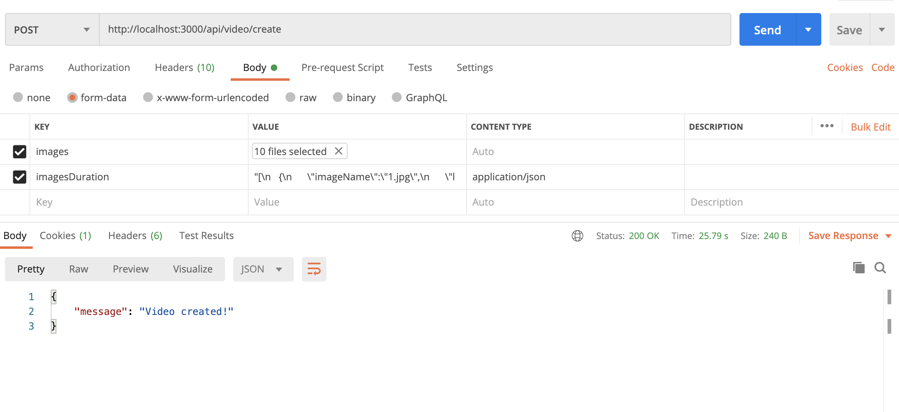

# NodeCreateVideoFromImages **WIP** :muscle:

**If this project has been useful to you and you want to help me to keep contributing to the open source with projects, examples, plugins,... collaborate and buy me a coffee.**

<a href="https://www.buymeacoffee.com/h6WVj4HcD" target="_blank"></a>

Sample project that shows how to create a video from images through an API request.

## Requirements

### Install ffmepg

If you use a MAC

```bash
brew install ffmpeg
```

For other operating systems please consult the [official documentation](https://ffmpeg.org/download.html).

## Development server

Run `npm run start:dev` for a dev server. The server will automatically reload if you change any of the source files.

## Testing the creation of a video

To test video generation you can use the following endpoints defined in the API:


```bash
GET /api/video/test
```

This endpoint will use the images stored in the /public/images directory.

```bash
POST /api/video/create
```

This endpoint expects the list of images and the durations of the images. For this, it is necessary that this information is sent as a multipart/form-data.

For example, if we use POSTMAN to test `/api/video/create` endpoint.

In the Body add a field of type file whose name is images and select the images to send.

Add a second field imagesDuration of type text whose value is a JSON with the duration of the images.

This JSON needs to be stringify to be able to send it in a field of type text.



JSON example

```bash
[
   {
      "imageName":"1.jpg",
      "loop":1
   },
   {
      "imageName":"2.jpg",
      "loop":2
   },
   {
      "imageName":"3.jpg",
      "loop":3
   },
   {
      "imageName":"4.jpg",
      "loop":4
   },
   {
      "imageName":"5.jpg",
      "loop":5
   },
   {
      "imageName":"6.jpg",
      "loop":6
   },
   {
      "imageName":"7.jpg",
      "loop":7
   },
   {
      "imageName":"8.jpg",
      "loop":8
   },
   {
      "imageName":"9.jpg",
      "loop":9
   },
   {
      "imageName":"10.jpg",
      "loop":10
   }
]
```
